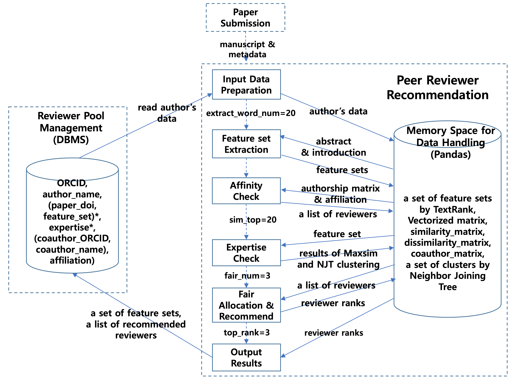

---

# An-Algorithm-for-Peer-Reviewer-Recommendation-based-on-Scholarly-Activity-Assessment
An Algorithm for Peer Reviewer Recommendation based on Scholarly Activity Assessment

---

An algorithm that recommends suitable peer reviewers for reviewing submitted manuscripts based on the assessment of scholarly activities. The assessment of reviewer candidates' scholarly activities is conducted based on the expertise in the field being researched, coauthor or coworker relationship with the author of the manuscript, and participation in reviewing.

The following workflow shows the workflow among Peer-Reviewer-Recommendation algorithm, journal management, and peer review contract management.


The following pipeline depicts the data management pipeline of Peer-Reviewer-Recommendation algorithm.



## Installation

The requirements.txt file includes most of the libraries used this project. However, it doesn't include common libraries. You might need to install it manually.

```
pip install -r .\requirements.txt
```

## How to use

**Notebook**

**Peer-Reviewer-Recommendation.ipynb**: It is a one block script in notebook.

## Important Note

It is highly recommended that you generate your own request header and edit on the scipts. Request has set a limit to the number of requests per hour. You might experience this problem frequently when same header is used.

```
'user-agent': <USER_AGENT_VALUE_FROM_REQUEST>
'accept': <ACCEPT_VALUE_FROM_REQUEST>
```

## Citations

If you use Peer-Reviewer-Recommendation algorithm in your work or conference, please cite us as follows

```
@misc{dong-hoon-choi-et al-2023,
    author = {Dong-Hoon Choi, Jin Woo Hyun, and Young Rock Kim},
    title = {An-Algorithm-for-Peer-Reviewer-Recommendation-based-on-Scholarly-Activity-Assessment},
    year = {2023},
    publisher = {GitHub},
    journal = {GitHub repository},
    howpublished = {\url{https://github.com/KYRLAB/An-Algorithm-for-Peer-Reviewer-Recommendation-based-on-Scholarly-Activity-Assessment}}
}
```

## Author Summary
**Dong-Hoon Choi** is a distinguished researcher in Korea Institute of Science and Technology Information.

**Young Rock Kim** is a professor in Graduate School of Education, Hankuk University of Foreign Studies. 

**Jin Woo Hyun** is a research fellows in Hankuk University of Foreign Studies.

---
